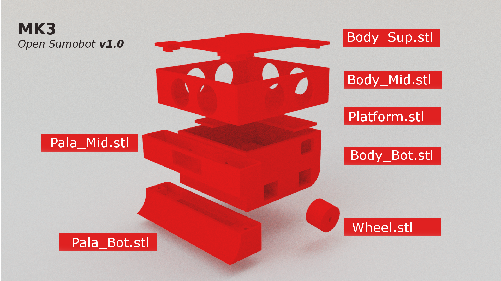

# Open-Sumobot-Project
## Post on my blog

https://pablopezasblog.wordpress.com/2016/08/04/open-sumobot-project-mk3/
## Electronics
* 1x Arduino nano V3
* 3x Hsr04 ultrasonic distance sensors
* 1x l991s Motor driver
* 1x Power switch
* 2x Tcrt5000 line sensors
* (Optional) 1 IR SHARP distance sensor
  ## Schematic

  

## Motion
* 4x N20 6V 200rpm motors
* 4x Lego rubber wheels
* 4x Wheel.stl

  ## 3D Printable parts
  
